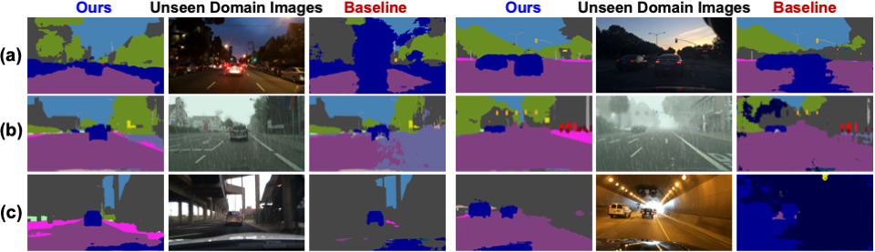
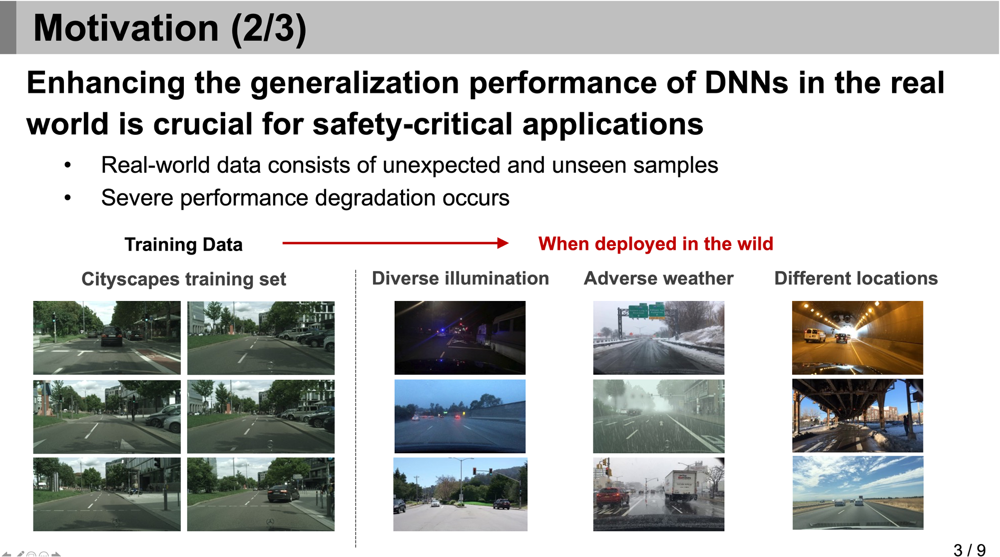

## RobustNet (CVPR 2021 Oral): Official Project Webpage
This repository provides the official PyTorch implementation of the following paper:
> **RobustNet:** Improving Domain Generalization in Urban-Scene Segmentationvia Instance Selective Whitening<br>
> Sungha Choi* (LG AI Research), Sanghun Jung* (KAIST AI), Huiwon Yun (Sogang Univ.)<br>
> Joanne T. Kim (Korea Univ.), Seungryong Kim (Korea Univ.), Jaegul Choo (KAIST AI) (*: equal contribution)<br>
> CVPR 2021, Accepted as Oral Presentation<br>

> Paper: [arxiv](https://arxiv.org/abs/2103.15597)<br>
> Slide: [slideshare](https://www.slideshare.net/SunghaChoi1/cvpr-2021-oral-robustnet-improving-domain-generalization-in-urbanscene-segmentation) <br>
> Youtube Video (English): [Youtube / 5min](https://youtu.be/3vf7Oh6gYEE) <br>
> Short Seminar (Korean): [LG AI Day / 12min](https://youtu.be/B-g1A1pIslg), [AIIS Spring Retreat / 7min](https://youtu.be/OAvvsp8KsYM)

> **Abstract:** 
*Enhancing the generalization performance of deep neural networks in the real world (i.e., unseen domains) is crucial for safety-critical applications such as autonomous driving.
To address this issue, this paper proposes a novel instance selective whitening loss to improve the robustness of the segmentation networks for unseen domains.
Our approach disentangles the domain-specific style and domain-invariant content encoded in higher-order statistics (i.e., feature covariance) of the feature representations and selectively removes only the style information causing domain shift.
As shown in the below figure, our method provides reasonable predictions for (a) low-illuminated, (b) rainy, and (c) unexpected new scene images.
These types of images are not included in the training dataset that the baseline shows a significant performance drop, contrary to ours.
Being simple but effective, our approach improves the robustness of various backbone networks without additional computational cost. 
We conduct extensive experiments in urban-scene segmentation and show the superiority of our approach over existing work.*<br>

<p align="center">
  
</p>

## Code Contributors
[Sungha Choi](https://www.linkedin.com/in/sungha-choi-1130185a/) (LG AI Research), [Sanghun Jung](https://www.linkedin.com/in/sanghun-jung-b17a4b1b8/) (KAIST AI)

## Concept Video
Click the figure to watch the youtube video of our paper!

<p align="center">
  <a href="https://youtu.be/3vf7Oh6gYEE"></a><br>
</p>

## Pytorch Implementation
### Installation
Clone this repository.
```
git clone https://github.com/shachoi/RobustNet.git
cd RobustNet
```
Install following packages.
```
conda create --name robustnet python=3.7
conda activate robustnet
conda install pytorch torchvision torchaudio cudatoolkit=10.2 -c pytorch
conda install scipy==1.1.0
conda install tqdm==4.46.0
conda install scikit-image==0.16.2
pip install tensorboardX
pip install thop
pip install kmeans1d
imageio_download_bin freeimage
```
### How to Run RobustNet
We evaludated RobustNet on [Cityscapes](https://www.cityscapes-dataset.com/), [BDD-100K](https://bair.berkeley.edu/blog/2018/05/30/bdd/),[Synthia](https://synthia-dataset.net/downloads/) ([SYNTHIA-RAND-CITYSCAPES](http://synthia-dataset.net/download/808/)), [GTAV](https://download.visinf.tu-darmstadt.de/data/from_games/) and [Mapillary Vistas](https://www.mapillary.com/dataset/vistas?pKey=2ix3yvnjy9fwqdzwum3t9g&lat=20&lng=0&z=1.5).

We adopt Class uniform sampling proposed in [this paper](https://openaccess.thecvf.com/content_CVPR_2019/papers/Zhu_Improving_Semantic_Segmentation_via_Video_Propagation_and_Label_Relaxation_CVPR_2019_paper.pdf) to handle class imbalance problems. [GTAVUniform](https://github.com/shachoi/RobustNet/blob/0538c69954c030273b3df952f90347572ecac53b/datasets/gtav.py#L306) and [CityscapesUniform](https://github.com/shachoi/RobustNet/blob/0538c69954c030273b3df952f90347572ecac53b/datasets/cityscapes.py#L324) are the datasets to which Class Uniform Sampling is applied.


1. For Cityscapes dataset, download "leftImg8bit_trainvaltest.zip" and "gtFine_trainvaltest.zip" from https://www.cityscapes-dataset.com/downloads/<br>
Unzip the files and make the directory structures as follows.
```
cityscapes
 └ leftImg8bit_trainvaltest
   └ leftImg8bit
     └ train
     └ val
     └ test
 └ gtFine_trainvaltest
   └ gtFine
     └ train
     └ val
     └ test
```
```
bdd-100k
 └ images
   └ train
   └ val
   └ test
 └ labels
   └ train
   └ val
```
```
mapillary
 └ training
   └ images
   └ labels
 └ validation
   └ images
   └ labels
 └ test
   └ images
   └ labels
```

#### We used [GTAV_Split](https://download.visinf.tu-darmstadt.de/data/from_games/code/read_mapping.zip) to split GTAV dataset into training/validation/test set. Please refer the txt files in [split_data](https://github.com/shachoi/RobustNet/tree/main/split_data).

```
GTAV
 └ images
   └ train
     └ folder
   └ valid
     └ folder
   └ test   
     └ folder
 └ labels
   └ train
     └ folder
   └ valid
     └ folder
   └ test   
     └ folder
```

#### We randomly splitted [Synthia dataset](http://synthia-dataset.net/download/808/) into train/val set. Please refer the txt files in [split_data](https://github.com/shachoi/RobustNet/tree/main/split_data).

```
synthia
 └ RGB
   └ train
   └ val
 └ GT
   └ COLOR
     └ train
     └ val
   └ LABELS
     └ train
     └ val
```

2. You should modify the path in **"<path_to_robustnet>/config.py"** according to your dataset path.
```
#Cityscapes Dir Location
__C.DATASET.CITYSCAPES_DIR = <YOUR_CITYSCAPES_PATH>
#Mapillary Dataset Dir Location
__C.DATASET.MAPILLARY_DIR = <YOUR_MAPILLARY_PATH>
#GTAV Dataset Dir Location
__C.DATASET.GTAV_DIR = <YOUR_GTAV_PATH>
#BDD-100K Dataset Dir Location
__C.DATASET.BDD_DIR = <YOUR_BDD_PATH>
#Synthia Dataset Dir Location
__C.DATASET.SYNTHIA_DIR = <YOUR_SYNTHIA_PATH>
```
3. You can train RobustNet with following commands.
```
<path_to_robustnet>$ CUDA_VISIBLE_DEVICES=0,1,2,3 ./scripts/train_r50os16_gtav_isw.sh # Train: GTAV, Test: BDD100K, Cityscapes, Synthia, Mapillary / ResNet50, Ours (ISW)
<path_to_robustnet>$ CUDA_VISIBLE_DEVICES=0,1,2,3 ./scripts/train_r50os16_gtav_ibn.sh # Train: GTAV, Test: BDD100K, Cityscapes, Synthia, Mapillary / ResNet50, IBN-Net
<path_to_robustnet>$ CUDA_VISIBLE_DEVICES=0,1,2,3 ./scripts/train_r50os16_gtav_base.sh # Train: GTAV, Test: BDD100K, Cityscapes, Synthia, Mapillary / ResNet50, Baseline (DeepLabV3+)
<path_to_robustnet>$ CUDA_VISIBLE_DEVICES=0,1 ./scripts/train_r50os16_cty_isw.sh # Train: Cityscapes, Test: BDD100K, GTAV, Synthia, Mapillary / ResNet50, Ours(ISW)
<path_to_robustnet>$ CUDA_VISIBLE_DEVICES=0,1 ./scripts/train_r50os16_cty_ibn.sh # Train: Cityscapes, / ResNet50, IBN-Net
<path_to_robustnet>$ CUDA_VISIBLE_DEVICES=0,1 ./scripts/train_r50os16_cty_base.sh # Train: Cityscapes, / ResNet50, Baseline (DeepLabV3+)
```
### Pretrained Models
#### All models trained for our paper
You can download all models evaluated in our paper at [Google Drive](https://drive.google.com/drive/folders/19i1G-gcJ3BV_VxO0ZG9YMJ4Btyj8c6dM?usp=sharing)

4. You can validate pretrained model with following commands.
```
<path_to_robustnet>$ CUDA_VISIBLE_DEVICES=0,1 ./scripts/valid_mobile_gtav_isw.sh <weight_file_location>
```

5. You can infer the segmentation results from images through pretrained model using a sliding window or a pooling method.
```
<path_to_robustnet>$ CUDA_VISIBLE_DEVICES=0,1 ./scripts/infer_r50os16_cty_isw.sh <weight_file_location> <result_save_location>
```

#### ImageNet pretrained ResNet-101 which has three 3×3 convolutions in the first layer
To train ResNet-101 based RobustNetNet, you should download ImageNet pretrained ResNet-101 from [this link](https://drive.google.com/file/d/1jMx3HdVqSlpIYIyG3VPi8q-ZiclOHlc7/view?usp=sharing). Put it into following directory.
```
<path_to_robustnet>/pretrained/resnet101-imagenet.pth
```
This pretrained model is from [MIT CSAIL Computer Vision Group](http://sceneparsing.csail.mit.edu/)

### Additional experimental results not published in paper
Training set: GTAV, Model: ResNet-101 OS8<br>
The averages of the three experimental results for each model are as follows.
|Model|BDD|Cityscapes|Mapillary|Synthia|GTAV|
|------|---|---|---|---|---|
|Baseline|24.85|30.06|31.50|28.78|74.71|
|IBN|33.30|33.63|36.50|31.32|74.46|
|ISW|35.37|37.09|38.50|30.49|74.49|

## Acknowledgments
Our pytorch implementation is heavily derived from [NVIDIA segmentation](https://github.com/NVIDIA/semantic-segmentation) and [HANet](https://github.com/shachoi/HANet).
Thanks to the NVIDIA implementations.
